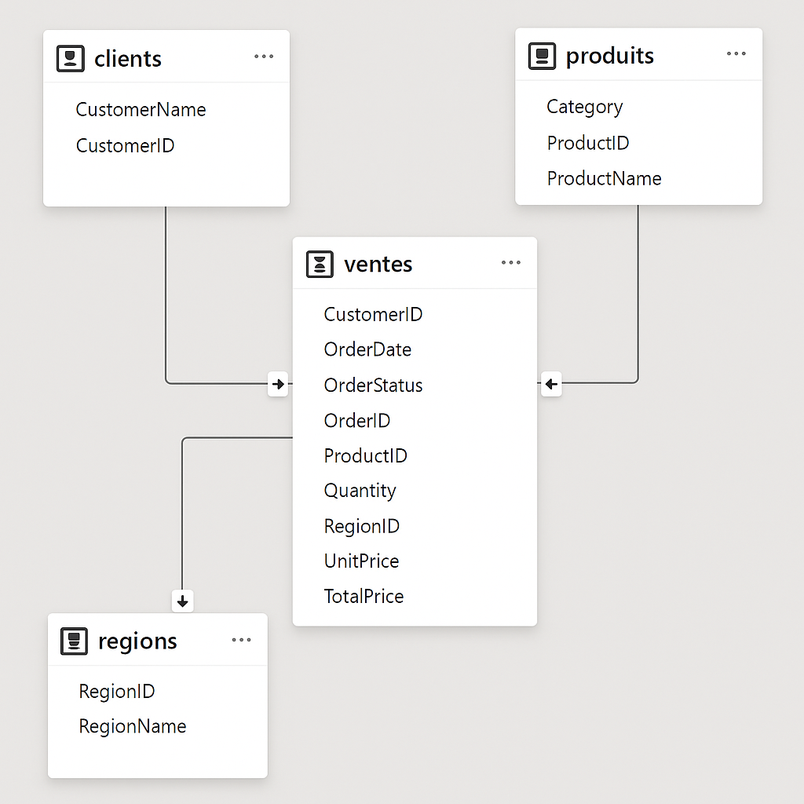

# 📊 Rapport de Réalisation – Dashboard Power BI : Suivi des Ventes

## 🧠 Objectif du projet
L’objectif de ce projet est de concevoir un **tableau de bord interactif Power BI** pour le suivi des ventes d’une entreprise.  
Ce tableau de bord permet d’analyser les performances commerciales selon plusieurs dimensions : **clients, produits, régions, et périodes**.

Le projet illustre les **concepts fondamentaux de la Business Intelligence (BI)** :
- Nettoyage et modélisation des données (Power Query)
- Modèle en étoile (Data Warehouse)
- Création de mesures DAX
- Conception visuelle cohérente et interactive

---

## 🗂️ Étapes de réalisation

### 1. Préparation et import des données
- Fichier source : `sales_2.csv`
- Importé dans **Power Query** via *Obtenir les données → Fichier texte/CSV*
- Vérification de la **qualité des données** :
  - Analyseur Power Query : qualité, distribution et profil de colonnes
  - Ajustement des **types de données** (Date, Texte, Décimal)

| Colonne initiale | Nouveau nom      |
|------------------|------------------|
| OrderID          | Id commande      |
| CustomerID       | Id client        |
| CompanyName      | Nom client       |
| ProductID        | Id produit       |
| ProductName      | Nom produit      |
| Category         | Catégorie produit|
| RegionID         | Id région        |
| RegionName       | Nom région       |
| OrderDate        | Date commande    |
| Quantity         | Quantité         |
| UnitPrice        | Prix unitaire    |
| TotalPrice       | Prix total       |
| OrderStatus      | Statut commande  |

---

### 2. Normalisation et création des tables de référence
À partir de la table brute, création de **références Power Query** pour normaliser le modèle :

| Table     | Colonnes conservées | Description |
|------------|--------------------|--------------|
| `Clients`  | Id client, Nom client | Dimension client |
| `Produits` | Id produit, Nom produit, Catégorie produit | Dimension produit |
| `Régions`  | Id région, Nom région | Dimension région |
| `Ventes`   | Id commande, Id client, Id produit, Id région, Quantité, Prix unitaire, Prix total, Date commande, Statut commande | Table de faits |

- Suppression des doublons
- Tri par identifiant
- Désactivation du chargement de la table source brute

---

### 3. Modélisation – Schéma en étoile
Le **modèle en étoile** a été construit comme suit :

- **Table centrale (Faits)** : `Ventes`
- **Tables de dimensions** : `Clients`, `Produits`, `Régions`, `Calendrier`

#### Relations :
| Dimension | Clé primaire | Clé étrangère dans `Ventes` |
|------------|---------------|-----------------------------|
| Clients    | Id client     | Id client                   |
| Produits   | Id produit    | Id produit                  |
| Régions    | Id région     | Id région                   |
| Calendrier | Date          | Date commande               |

> La relation est de type **1 → * (un à plusieurs)** avec un **filtrage simple**.

---

### 4. Création des mesures DAX

Table de mesures : `Mesures`

```DAX
Total ventes = SUM(Ventes[Prix total])
Nombre de commandes = DISTINCTCOUNT(Ventes[Id commande])
Quantité vendue = SUM(Ventes[Quantité])
Commande moyenne = DIVIDE([Total ventes], [Nombre de commandes])
```


### 5. Création du dashboard Power BI

#### 🎨 Thème et mise en page
- **Thème** : *Loomy Lime Theme* (importé via fichier JSON)  
- **Fond** : `#1E2D38`  
- **Couleurs des cartes** : `#232448`  
- **Hauteur de page** : 2000 px  
- **Organisation** : disposition harmonisée sur une grille  

---

#### 📈 Visuels principaux
1. **KPI Cards**
   - Total des ventes  
   - Nombre de commandes  
   - Quantité vendue  
   - Commande moyenne  

2. **Évolution temporelle**
   - Graphique de type *Courbe* pour suivre le chiffre d’affaires par mois  

3. **Répartition du CA par région**
   - Graphique en *barres horizontales* pour comparer les performances régionales  

4. **Répartition du CA par catégorie de produit**
   - Graphique *Donut (anneau)*  

5. **Tableau détaillé**
   - Liste des commandes comprenant :  
     - Id commande  
     - Client  
     - Produit  
     - Statut  
     - Date  
   - Filtres et style personnalisés pour la lisibilité  

---

#### 🧭 Filtres interactifs
- Filtre de **plage de dates**  
- Filtre sur le **statut de commande**  
- Filtre sur la **région**  

---

### 6. Résultats et analyse
- Visualisation intuitive de la performance commerciale  
- Identification rapide des **régions à forte activité**  
- Suivi de l’évolution du **chiffre d’affaires** et du **volume des ventes**  
- Outil interactif pour une **prise de décision rapide et éclairée**

---

### 7. Compétences mobilisées
- **Power BI Desktop** (modélisation & DAX)  
- **Power Query** (ETL et nettoyage)  
- **Conception de modèle en étoile**  
- **Visual Design & Thèmes JSON**  
- **Git & GitHub** (versioning et publication)

---

## 🧾 Aperçu du modèle


---

## 👤 Auteur
**Omar Ouchchen**  
📍 Rabat, Maroc  
📧 [ouchcheno@gmail.com](mailto:ouchcheno@gmail.com)  
🌐 [GitHub – ouchchenomar](https://github.com/ouchchenomar)  
🔗 [LinkedIn – Omar Ouchchen](https://linkedin.com/in/omar-ouchchen-11b579221)

Quantité vendue = SUM(Ventes[Quantité])
Commande moyenne = DIVIDE([Total ventes], [Nombre de commandes])
